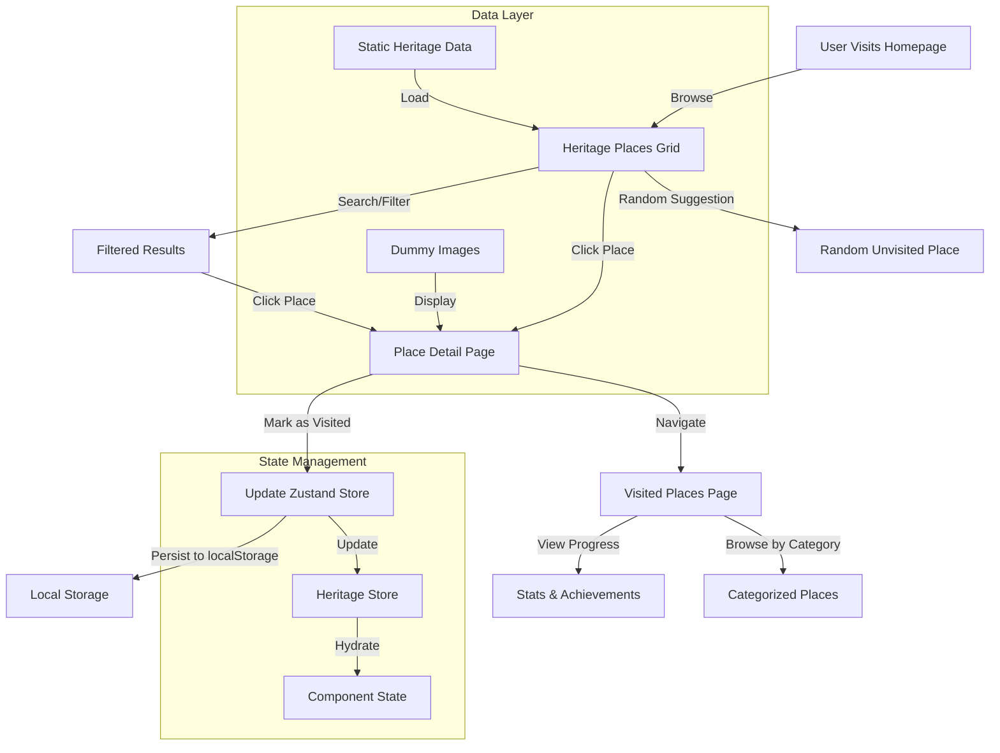

# Table of Contents

1. [Heritage Tracker](#heritage-tracker)
2. [Requirements](#requirements)
3. [Documentation](#documentation)
    - [Tech Stack](#tech-stack)
    - [Project Structure](#project-structure)
    - [Architecture Overview](#architecture-overview)
4. [Features](#features)
5. [Application Flow Diagram](#application-flow-diagram)
6. [Available Commands](#available-commands)
    - [Development](#development)
    - [Production](#production)
7. [Setup and Installation](#setup-and-installation)
8. [Data & Images](#data--images)
9. [Deployment](#deployment)

# Heritage Tracker

A modern web application for exploring and tracking visits to Malaysia's cultural heritage sites. Built with Next.js 14, TypeScript, and Tailwind CSS, this application allows users to discover historical places, mark them as visited, and track their heritage exploration journey.

## Requirements

-   **Node.js**: `>= 18.17.0`
-   **npm**: `>= 9.0.0` (or **yarn**: `>= 1.22.0`)
-   **Modern Browser**: Chrome, Firefox, Safari, or Edge (latest versions)

## Documentation

### Tech Stack

-   **Framework**: Next.js 14 (App Router)
-   **Language**: TypeScript
-   **Styling**: Tailwind CSS
-   **UI Components**: shadcn/ui (Radix UI primitives)
-   **State Management**: Zustand with persistence
-   **Icons**: Lucide React
-   **Build Tool**: Next.js built-in bundler
-   **Deployment**: Vercel (recommended)

### Project Structure

```
heritage-tracker/
├── src/
│   ├── app/                    # Next.js App Router pages
│   │   ├── layout.tsx          # Root layout component
│   │   ├── page.tsx            # Home page (place listings)
│   │   ├── place/
│   │   │   └── [id]/
│   │   │       └── page.tsx    # Individual place detail page
│   │   ├── visited/
│   │   │   └── page.tsx        # Visited places page
│   │   └── globals.css         # Global styles and Tailwind
│   ├── components/             # Reusable React components
│   │   ├── ui/                 # shadcn/ui base components
│   │   │   ├── badge.tsx
│   │   │   ├── button.tsx
│   │   │   ├── card.tsx
│   │   │   └── input.tsx
│   │   ├── Header.tsx          # Navigation header
│   │   ├── HeritageCard.tsx    # Place card component
│   │   ├── Pagination.tsx      # Pagination controls
│   │   ├── SearchAndFilter.tsx # Search and category filters
│   │   └── StatsOverview.tsx   # Statistics dashboard
│   ├── data/                   # Static data and configurations
│   │   └── heritageData.ts     # Heritage places dummy data
│   ├── lib/                    # Utility functions
│   │   └── utils.ts            # Common utilities (cn, formatters)
│   ├── store/                  # State management
│   │   └── useHeritageStore.ts # Zustand store for app state
│   └── types/                  # TypeScript type definitions
│       └── heritage.ts         # Heritage place interfaces
├── public/                     # Static assets
├── .next/                      # Next.js build output
├── node_modules/               # Dependencies
├── components.json             # shadcn/ui configuration
├── next.config.mjs             # Next.js configuration
├── package.json                # Project dependencies and scripts
├── tailwind.config.ts          # Tailwind CSS configuration
├── tsconfig.json               # TypeScript configuration
└── README.md                   # Project documentation
```

### Architecture Overview

This project follows **modern React patterns** and **component-based architecture** with clear separation of concerns:

1. **Pages (App Router)**:

    - Server and client components using Next.js 14 App Router
    - File-based routing with dynamic segments
    - Located in `src/app/`

2. **Components**:

    - Reusable UI components following atomic design principles
    - shadcn/ui components for consistent design system
    - Located in `src/components/`

3. **State Management**:

    - Zustand for lightweight state management
    - Persistent storage for user visit tracking
    - Located in `src/store/`

4. **Data Layer**:

    - Static dummy data for heritage places
    - Type-safe interfaces and data models
    - Located in `src/data/` and `src/types/`

5. **Styling**:

    - Utility-first CSS with Tailwind
    - Custom CSS variables for theming
    - Responsive design with mobile-first approach

6. **Utilities**:
    - Helper functions for formatting and common operations
    - Type utilities and validation helpers
    - Located in `src/lib/`

## Features

-   **Heritage Place Discovery**:

    -   Browse 50+ Malaysian heritage sites with detailed information
    -   Search functionality with real-time filtering
    -   Category-based filtering (temples, palaces, forts, monuments, sites, museums)

-   **Visit Tracking**:

    -   Mark places as visited/unvisited
    -   Progress tracking with completion percentage
    -   Achievement badges based on visit milestones

-   **Responsive Design**:

    -   Mobile-first responsive layout
    -   Touch-friendly interface for mobile devices
    -   Adaptive grid layouts for different screen sizes

-   **Modern UI/UX**:

    -   Clean, modern interface with smooth animations
    -   Dark/light mode support (system preference)
    -   Intuitive navigation and user flows

-   **Performance Optimized**:

    -   Next.js 14 with App Router for optimal performance
    -   Image optimization with Next.js Image component
    -   Pagination for efficient data loading

-   **Data Persistence**:
    -   Visit status saved locally using Zustand persist
    -   No external database required
    -   Instant loading of user preferences

## Application Flow Diagram

The following diagram explains the user journey and data flow within the application:



**Flow Explanation**:

1. **Homepage**: Users start at the main page with a grid of heritage places
2. **Discovery**: Users can search, filter by category, or get random suggestions
3. **Details**: Clicking a place shows detailed information, images, and highlights
4. **Tracking**: Users can mark places as visited, updating the global state
5. **Persistence**: Visit data is automatically saved to browser localStorage
6. **Progress**: Users can view their progress, achievements, and visited places
7. **Categories**: Visited places are organized by type for easy browsing

## Available Commands

### Development

-   **Start development server**:
    ```bash
    npm run dev
    ```
-   **Build for production**:
    ```bash
    npm run build
    ```
-   **Start production server**:
    ```bash
    npm run start
    ```
-   **Lint code**:
    ```bash
    npm run lint
    ```

### Production

-   **Production build and start**:
    ```bash
    npm run build && npm run start
    ```

## Setup and Installation

1. **Clone the repository**:

    ```bash
    git clone <repository-url>
    cd heritage-tracker
    ```

2. **Install dependencies**:

    ```bash
    npm install
    # or
    yarn install
    ```

3. **Start development server**:

    ```bash
    npm run dev
    ```

4. **Open in browser**:

    - Navigate to `http://localhost:3000`
    - The application will automatically reload when you make changes

5. **Build for production** (optional):
    ```bash
    npm run build
    npm run start
    ```

## Data & Images

### Heritage Places Data

The application uses **static dummy data** for demonstration purposes:

-   **Location**: `src/data/heritageData.ts`
-   **Total Places**: 50 Malaysian heritage sites
-   **Categories**: 6 types (temples, palaces, forts, monuments, archaeological sites, museums)
-   **Data Structure**: Each place includes:
    -   Basic information (name, description, location)
    -   Visit details (opening hours, ticket prices)
    -   Metadata (rating, visitor count, year established)
    -   Highlights and features

### Images

All images are **dummy placeholder images** using:

-   **Source**: Picsum Photos (`https://picsum.photos/`)
-   **Format**: Random landscape images sized 800x600
-   **Fallback**: Gray placeholder with "No Image Available" text
-   **Optimization**: Next.js Image component with automatic optimization
-   **Note**: In a production application, these would be replaced with actual photographs of the heritage sites

### Data Persistence

-   **Visit Status**: Stored locally using Zustand persist middleware
-   **Storage**: Browser localStorage (no external database)
-   **Hydration**: Safe client-side hydration to prevent SSR mismatches
-   **Reset**: Users can reset their visit data by clearing browser storage

## Deployment

### Vercel (Recommended)

1. **Connect repository** to Vercel
2. **Configure build settings**:
    - Build Command: `npm run build`
    - Output Directory: `.next`
    - Install Command: `npm install`
3. **Deploy**: Automatic deployment on git push

### Other Platforms

-   **Netlify**: Configure build command as `npm run build && npm run export`
-   **Docker**: Use the included Dockerfile for containerized deployment
-   **Static Export**: Run `npm run build` for static site generation

### Environment Configuration

No environment variables required for basic functionality. Optional configurations:

-   `NEXT_PUBLIC_SITE_URL`: For absolute URLs in production
-   `ANALYZE`: Set to `true` to analyze bundle size

---

**Note**: This is a demonstration project using dummy data. In a production environment, the heritage data would be sourced from official tourism databases, and images would be high-quality photographs of actual heritage sites.
